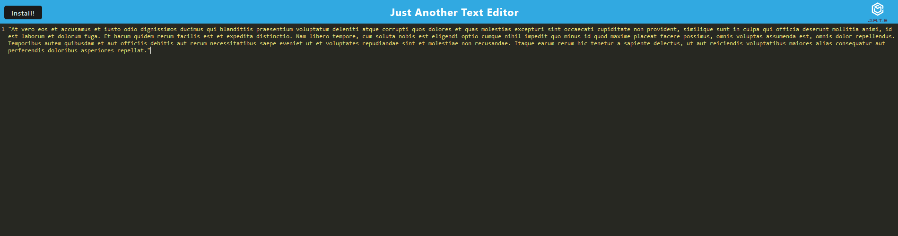

# Just Another Text Editor
  
  ## Description
  A simple text editor application to be run in browser. Installable PWA so that text persists.
  ## Deployed Application URL
  [https://pwa-text-editor99-a763eb7a25e2.herokuapp.com/](https://pwa-text-editor99-a763eb7a25e2.herokuapp.com/)
  ## Screenshot
  
  ## Table of Contents
  * [Technologies Used](#Technologies-Used)
  * [Contributors](#contributors)
  * [Testing](#testing)
  * [Questions](#questions)
  ## Technologies Used:
  JS, Node.js, HTML, CSS, nodemon, Express
  ## Contributors
  Gary Almes for helper code.
  ## Questions
  Send all questions to tridean97@gmail.com or check out my [GitHub](https://github.com/tridean).
  ## License
This project is covered under MIT.
